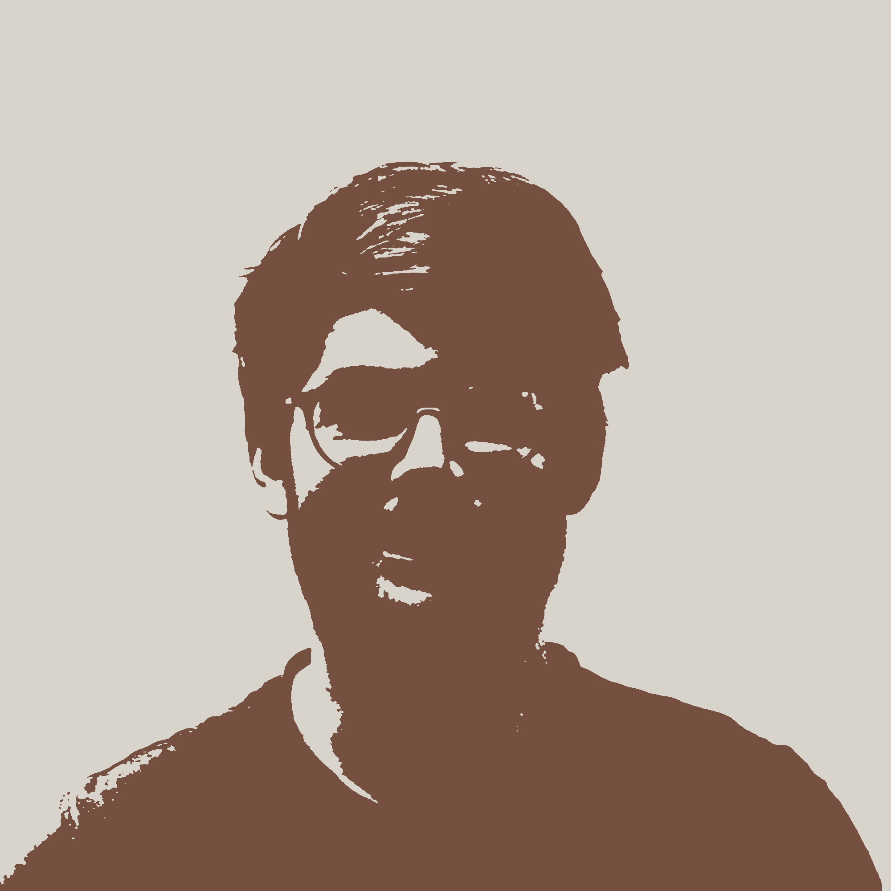
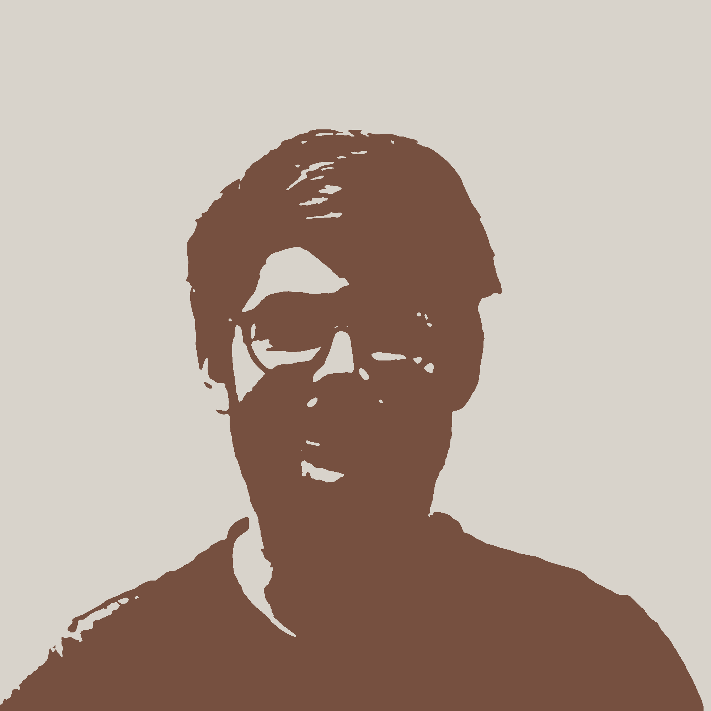
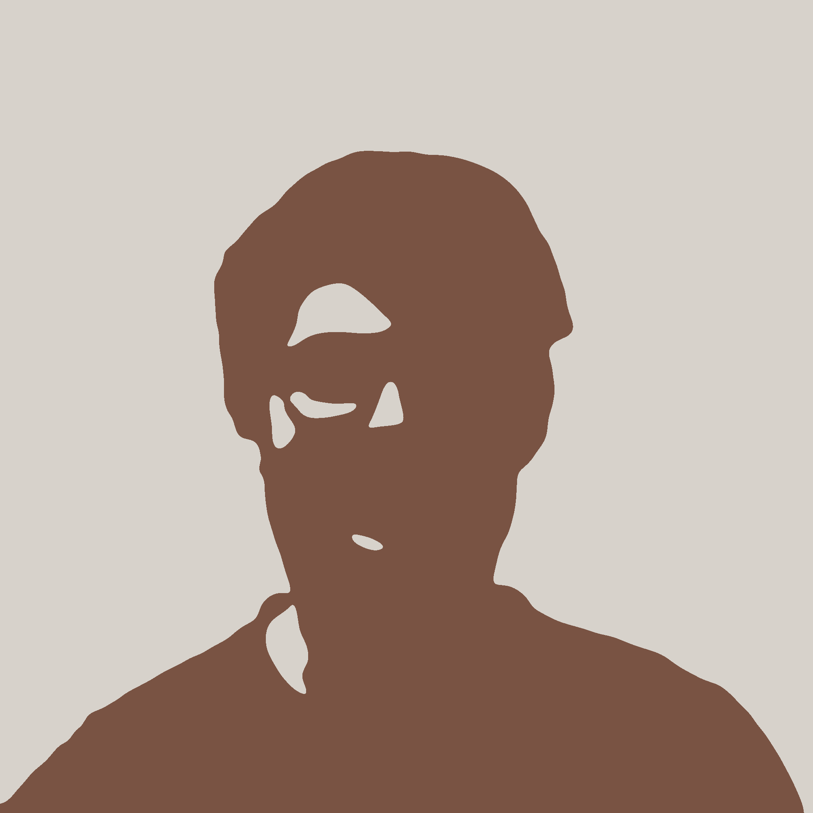
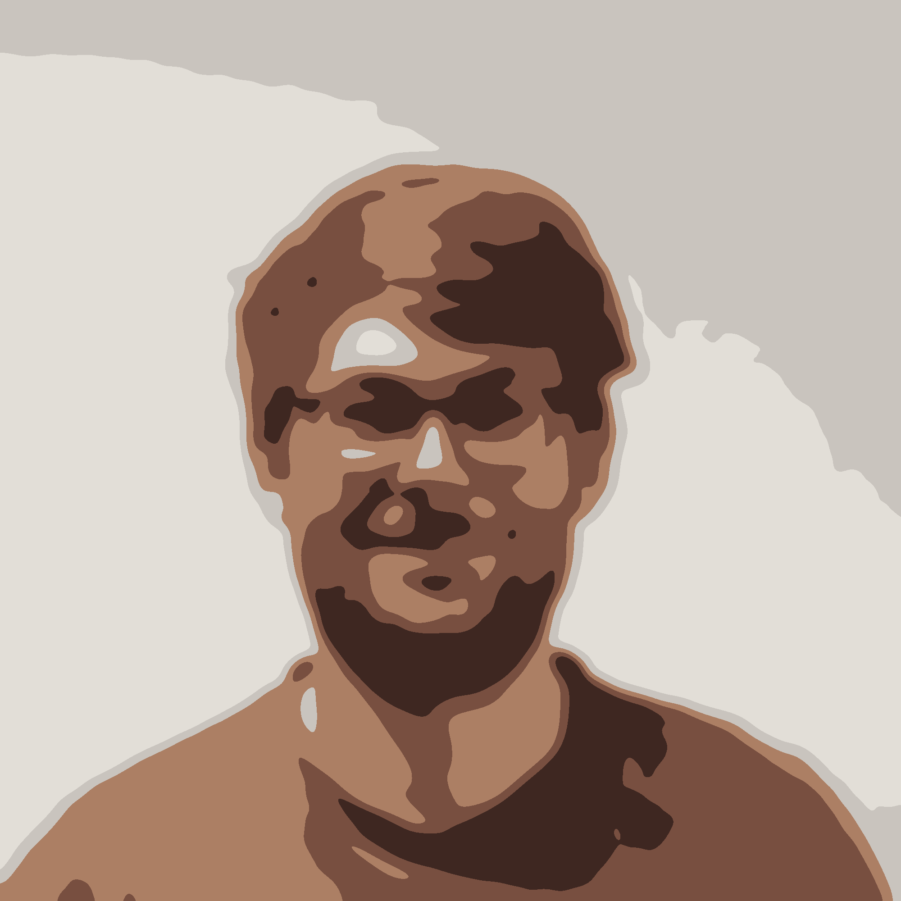
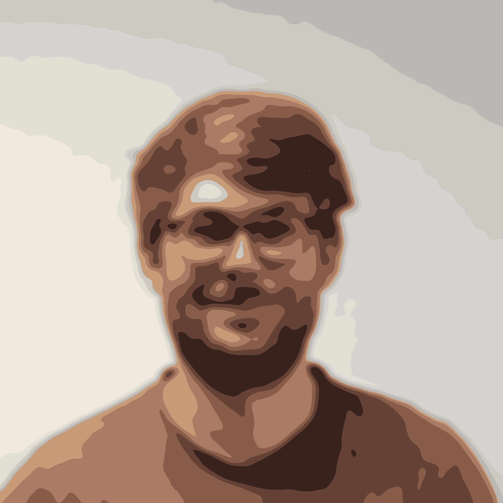
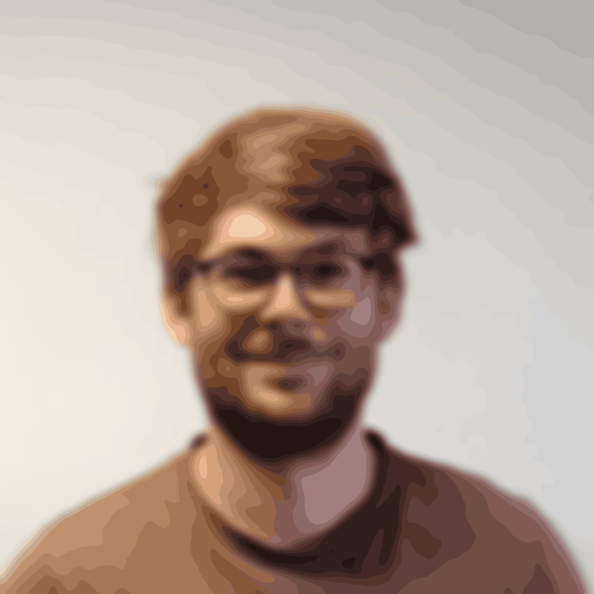
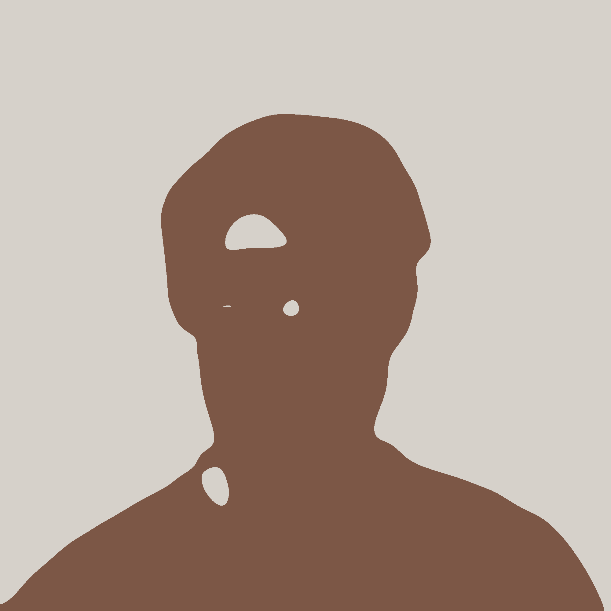
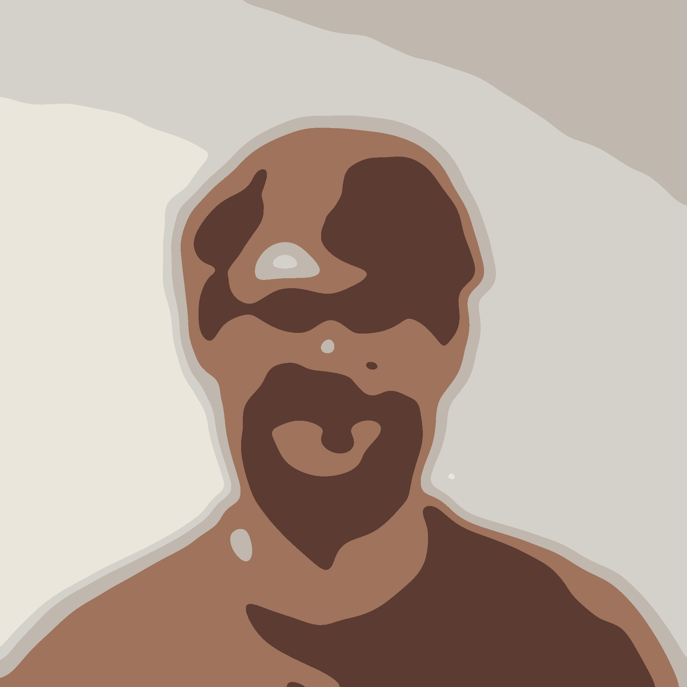
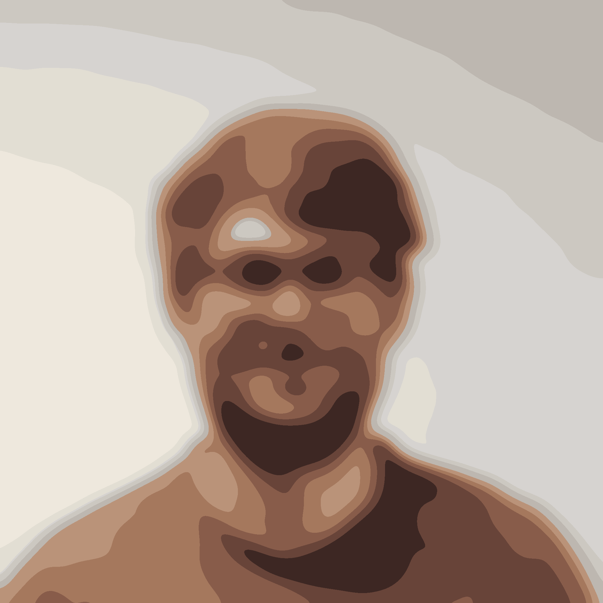
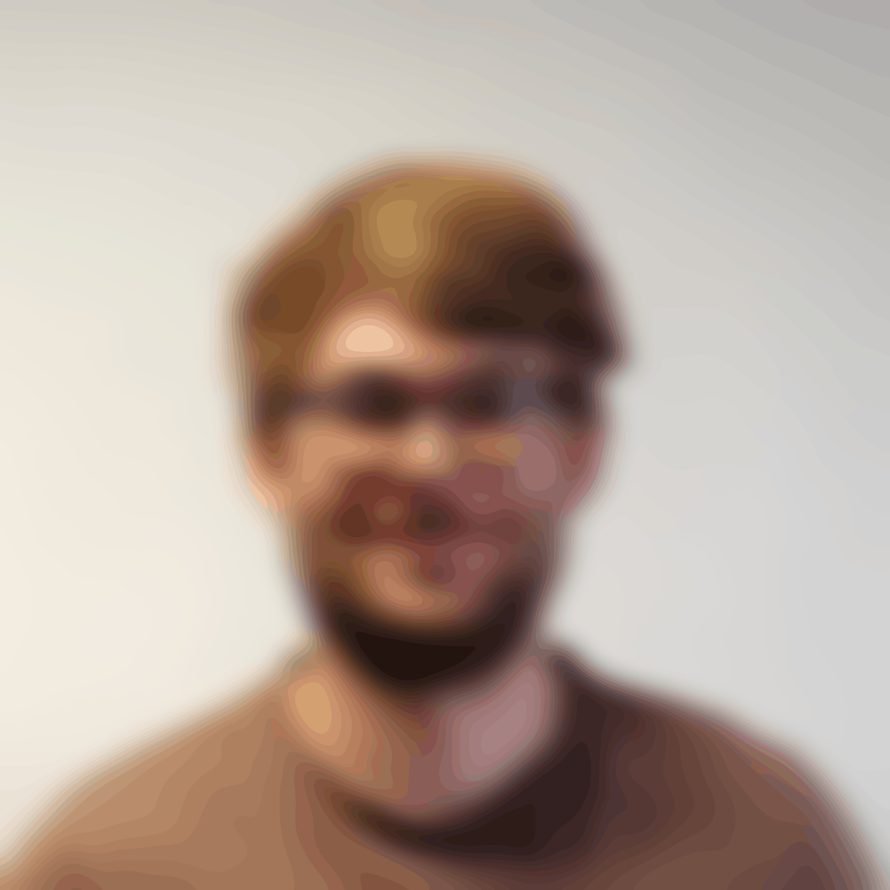

# Fast gaussian quantization

Fast gaussian blur + Image quantization = Fast gaussian quantization.

This works followed closely the work I have done on [image voronoization](https://github.com/bfraboni/voronoi). The [Codegolf thread](https://codegolf.stackexchange.com/questions/50299/draw-an-image-as-a-voronoi-map) that initiated the aforementionned project links another related [Codegolf thread](https://codegolf.stackexchange.com/questions/42217/paint-by-numbers) "Paint by Numbers", which I again wanted to try. 

The answer provided by DavidC is a Mathematica code that perform a Gaussian blur step then an image quantization. Pretty simple and giving nice results ! I decided to port the exact same routine to C++, using my implementation of the fast gaussian blur approximation by IvanK (see details [here](http://blog.ivank.net/fastest-gaussian-blur.html) and my code [here](https://gist.github.com/bfraboni/946d9456b15cac3170514307cf032a27)) and a classic K-Means pass for image quantization.

Here is the result:

||2|5|10|25|50|100|200|
|:-:|:-:|:-:|:-:|:-:|:-:|:-:|:-:|
|0||||||||
|1||||||||
|2||||||||
|4||||||||
|8||||||||
|16||||||||
|32||||||||

